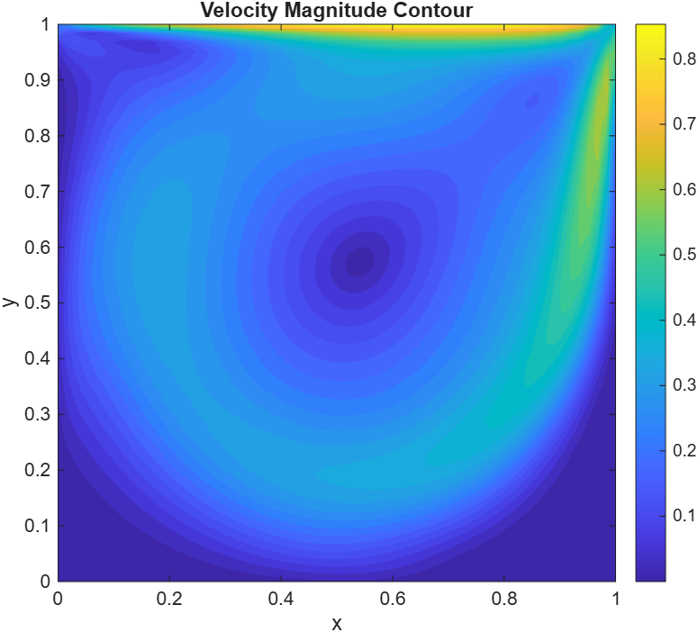
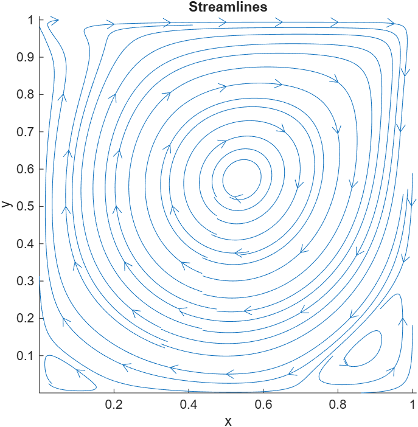
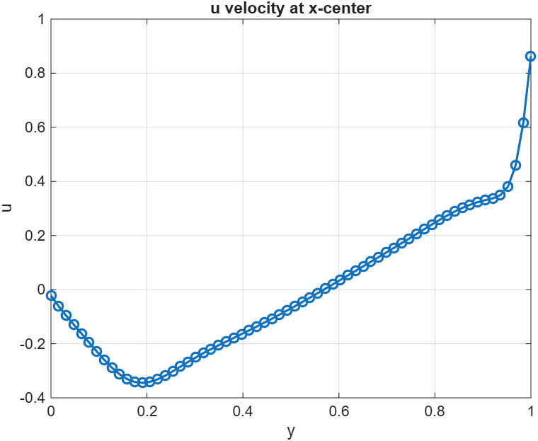
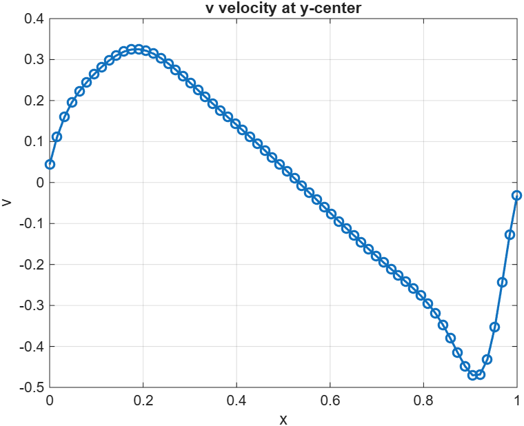

# Lid-Driven Cavity Solver — Collocated FVM with Fractional Step Method

---

## Table of Contents

1. [Problem Statement](#1-problem-statement)
2. [Domain, Grid, and Variable Arrangement](#2-domain-grid-and-variable-arrangement)
3. [Governing Equations — Incompressible Navier–Stokes (FVM Form)](#3-governing-equations--incompressible-navierstokes-fvm-form)
4. [Convection Term — FVM Discretisation](#4-convection-term--fvm-discretisation)
5. [Diffusion Term — FVM Discretisation](#5-diffusion-term--fvm-discretisation)
6. [Fractional Step Algorithm — 6-Step Procedure](#6-fractional-step-algorithm--6-step-procedure)
7. [Pressure Poisson Equation](#7-pressure-poisson-equation)
8. [Boundary Conditions](#8-boundary-conditions)
9. [Time Step Constraint](#9-time-step-constraint)
10. [File Structure](#10-file-structure)
11. [Parameters](#11-parameters)
12. [Results](#12-results)

---

## 1. Problem Statement

Solve the **2D incompressible Navier–Stokes equations** in a square lid-driven cavity:

$$\frac{\partial u_i}{\partial t} = - C_i + D_i - \frac{\delta^P P}{\delta x_i}$$

$$\frac{\delta u_i}{\delta x_i} = 0 \quad \text{(continuity)}$$

where $C_i$ is the convection term, $D_i$ is the diffusion term, and $\delta^P/\delta x_i$ denotes the discrete pressure gradient. The velocity field must have zero divergence at every time step — enforced through a pressure Poisson equation.

> For incompressible flow, mass conservation gives us the pressure. The divergence-free constraint $\delta u_i / \delta x_i = 0$ must hold at every time step — this is what the Poisson solve enforces.

---

## 2. Domain, Grid, and Variable Arrangement

$$x \in [0, 1], \quad y \in [0, 1]$$

**Collocated arrangement:** $u$, $v$, and $P$ are all stored at cell centres $(l, m)$ on a uniform Cartesian grid with ghost cells surrounding the domain.

```
  ┌─────────────────────┐
  │  U_lid = 1 (top)    │   ← moving lid, u = 1
  │                     │
  │   u, v, P @ (l,m)   │   ← all variables collocated at cell centres
  │                     │
  │  u=v=0 on all walls │   ← no-slip on left, right, bottom
  └─────────────────────┘
```

The grid has $(N_x + 2) \times (N_x + 2)$ storage including one layer of ghost cells on each side. Interior cells are indexed $2 : N_x+1$ in both directions.

**Face velocities** are stored separately:
- `u_cell_face_sides_intp` — $u$, $v$ at left/right (side) faces
- `u_cell_face_tb_intp` — $u$, $v$ at top/bottom faces

> Using $(l, m)$ indexing instead of $(i, j)$ for convenience, consistent with the notes.

---

## 3. Governing Equations — Incompressible Navier–Stokes (FVM Form)

Integrating the momentum equation over a control volume $V = \Delta x \Delta y$:

$$\int_V \frac{\partial u_i}{\partial t} dV = -\int_V \frac{\partial (u_i u_j)}{\partial x_j} dV + \gamma \int_V \frac{\partial^2 u_i}{\partial x_j \partial x_j} dV - \int_V \frac{\partial P}{\partial x_i} dV$$

By the divergence theorem, the volume integrals of divergence terms become surface integrals over cell faces:

$$V \frac{\partial u_i}{\partial t}\bigg|_{l,m} = \Delta x \Delta y \frac{\partial u_i}{\partial t}\bigg|_{l,m}$$

This gives the semi-discrete form per cell:

$$\frac{\partial u_i}{\partial t} = C_i + D_i - \frac{\delta^P P}{\delta x_i}$$

---

## 4. Convection Term — FVM Discretisation

The convection term is converted to a face flux sum via the divergence theorem:

$$\int_V \frac{\partial (u_i u_j)}{\partial x_j} dV = \oint_S u_i V_N \, dS = \sum_f u_{i,f} \, V_{N,f} \, A_f$$

where $V_{N,f}$ is the **normal velocity at face** $f$ and $A_f$ is the face area. The scalar $u_i$ at each face is interpolated as the average of the two neighbouring cell centres (linear interpolation on uniform mesh).

**For $i=1$ ($u$-momentum), expanded over 4 faces of cell $(l,m)$:**

$$\Delta x \Delta y \, C(u) = \left(\frac{u_{l,m} + u_{l+1,m}}{2}\right) u_{l+1/2,m} \Delta y - \left(\frac{u_{l,m} + u_{l-1,m}}{2}\right) u_{l-1/2,m} \Delta y$$

$$+ \left(\frac{u_{l,m} + u_{l,m+1}}{2}\right) v_{l,m+1/2} \Delta x - \left(\frac{u_{l,m} + u_{l,m-1}}{2}\right) v_{l,m-1/2} \Delta x$$

where $u_{l+1/2,m}$, $v_{l,m+1/2}$ etc. are the **normal velocities at cell faces** (from the interpolated face arrays).

**For $i=2$ ($v$-momentum):** same structure with $v$ replacing $u$ as the transported scalar, same normal face velocities.

> The normal velocity at a face stays the same for both momentum equations — only the transported quantity ($u$ or $v$) changes. This is consistent with the FVM unstructured representation where $\sum_f V_{N,f} A_f$ determines the divergence.

**Implemented in:** `convection.m`

---

## 5. Diffusion Term — FVM Discretisation

$$\int_V \frac{\partial^2 u_i}{\partial x_j \partial x_j} dV = \oint_S \frac{\partial u_i}{\partial N} dS = \sum_f \frac{\partial u_i}{\partial N}\bigg|_f A_f$$

The normal derivative at each face is approximated by a **central difference** between adjacent cell centres:

**For $i=1$ ($u$-momentum):**

$$\Delta x \Delta y \, D(u) = \gamma \left[\frac{u_{l+1,m} - u_{l,m}}{\Delta x} \Delta y + \frac{u_{l-1,m} - u_{l,m}}{\Delta x} \Delta y + \frac{u_{l,m+1} - u_{l,m}}{\Delta y} \Delta x + \frac{u_{l,m-1} - u_{l,m}}{\Delta y} \Delta x\right]$$

**For $i=2$ ($v$-momentum):** identical with $v$ replacing $u$.

The normal derivatives at faces are pre-computed and stored in arrays (`u_cell_sides_nrdr`, `u_cell_tb_nrdr`) before entering the time loop.

**Implemented in:** `nrml_drv.m` (normal derivatives at faces), `diffusion.m` (assembles $D_i$ per cell)

---

## 6. Fractional Step Algorithm — 6-Step Procedure

The solver uses a **fractional step (projection) method** — velocity is first advanced without pressure (prediction), then corrected using a pressure increment $\Delta t P$ to enforce continuity. The nonlinear convection term uses **2nd-order Adams–Bashforth** ($t > 0$) or **Euler** ($t = 0$).

---

### Step 1 — Predict Velocity (without pressure)

Advance $u_i$ using convection + diffusion only, leaving pressure out of the prediction:

**At $t = 0$ (Euler):**

$$\hat{u}_i^{n+1} = u_i^n + \Delta t \left(C_i^n + D_i^n\right)$$

**At $t > 0$ (Adams–Bashforth 2nd order):**

$$\hat{u}_i^{n+1} = u_i^n + \Delta t \left[\frac{3}{2}\left(C_i^n + D_i^n\right) - \frac{1}{2}\left(C_i^{n-1} + D_i^{n-1}\right)\right]$$

> The predicted velocity $\hat{u}_i$ does not satisfy continuity. That is corrected in Steps 3–6.

Boundary conditions are applied to the predicted cell-centre velocities immediately after.

**Implemented in:** time loop in `main_code_FVM.m`

---

### Step 2 — Interpolate Predicted Face Velocities

Compute the predicted normal face velocities $\hat{V}_{N,f}$ by linear interpolation from predicted cell centres (uniform mesh → simple average):

$$\hat{u}_{l+1/2,m} = \frac{\hat{u}_{l,m} + \hat{u}_{l+1,m}}{2}, \quad \hat{u}_{l-1/2,m} = \frac{\hat{u}_{l,m} + \hat{u}_{l-1,m}}{2}$$

$$\hat{v}_{l,m+1/2} = \frac{\hat{v}_{l,m} + \hat{v}_{l,m+1}}{2}, \quad \hat{v}_{l,m-1/2} = \frac{\hat{v}_{l,m} + \hat{v}_{l,m-1}}{2}$$

These face velocities are **without pressure** — they represent the predicted state before the pressure correction.

**Implemented in:** `interpl_faces.m`

---

### Step 3 — Corrector Step for Face-Normal Velocities

The true face velocity differs from the predicted one by the pressure gradient. From the original momentum equation at a face:

$$V_{N,f} - \hat{V}_{N,f} = -\frac{\delta^P (\Delta t P)}{\delta N}\bigg|_f$$

Expanding for each face of cell $(l,m)$:

$$u_{l+1/2,m} = \hat{u}_{l+1/2,m} - \frac{\delta^P (\Delta t P)}{\delta x}\bigg|_{l+1/2,m}$$

$$u_{l-1/2,m} = \hat{u}_{l-1/2,m} + \frac{\delta^P (\Delta t P)}{\delta x}\bigg|_{l-1/2,m}$$

$$v_{l,m+1/2} = \hat{v}_{l,m+1/2} - \frac{\delta^P (\Delta t P)}{\delta y}\bigg|_{l,m+1/2}$$

$$v_{l,m-1/2} = \hat{v}_{l,m-1/2} + \frac{\delta^P (\Delta t P)}{\delta y}\bigg|_{l,m-1/2}$$

The pressure increment $\Delta t P$ is what we need to find — this comes from Step 4.

**Implemented in:** `del_t_P_faces.m` (computes face-level pressure gradients), velocity correction loop in `main_code_FVM.m`

---

### Step 4 — Pressure Poisson Equation

Applying the continuity condition $\sum_f V_{N,f} A_f = 0$ to the corrected face velocities from Step 3:

$$\sum_f \frac{\delta^P (\Delta t P)}{\delta N}\bigg|_f A_f = \sum_f \hat{V}_{N,f} A_f$$

The left side is the **discrete Laplacian** (divergence of gradient = Laplacian operator). The right side is the **divergence of the predicted velocity** — which is the source term. Written out in discrete form for cell $(l,m)$:

$$\left[\frac{\delta^P(\Delta t P)}{\delta x}\bigg|_{l+1/2,m} - \frac{\delta^P(\Delta t P)}{\delta x}\bigg|_{l-1/2,m}\right]\Delta y + \left[\frac{\delta^P(\Delta t P)}{\delta y}\bigg|_{l,m+1/2} - \frac{\delta^P(\Delta t P)}{\delta y}\bigg|_{l,m-1/2}\right]\Delta x$$

$$= \left(\hat{u}_{l+1/2,m} - \hat{u}_{l-1/2,m}\right)\Delta y + \left(\hat{v}_{l,m+1/2} - \hat{v}_{l,m-1/2}\right)\Delta x$$

This is the **pressure Poisson equation** solved iteratively using **Gauss–Seidel** with Neumann boundary conditions $\delta P / \delta N = 0$ on all walls. The pressure singularity is fixed by pinning $P(2,2) = 0$.

> **Neumann BC on pressure** ($\delta P / \delta N = 0$) means $\hat{u} = u^{n+1}$, $\hat{v} = v^{n+1}$ on boundaries — the predicted velocities already satisfy the wall BCs, so no pressure correction is needed there.

**Implemented in:** `pressure_poisson_GS.m`

---

### Step 5 — Correct Face-Normal Velocities

Using the pressure field $\Delta t P$ from Step 4, update the face velocities via the relations derived in Step 3. The face-level pressure gradients are computed using central differences between adjacent cell-centre pressure values:

$$\frac{\delta^P (\Delta t P)}{\delta x}\bigg|_{l+1/2,m} = \frac{\Delta t P|_{l+1,m} - \Delta t P|_{l,m}}{\Delta x}$$

$$\frac{\delta^P (\Delta t P)}{\delta y}\bigg|_{l,m+1/2} = \frac{\Delta t P|_{l,m} - \Delta t P|_{l,m+1}}{\Delta y}$$

Wall BCs are then re-enforced: set corrected face velocities to zero at all wall faces.

**Implemented in:** `del_t_P_faces.m` + correction in `main_code_FVM.m`

---

### Step 6 — Correct Cell-Centre Velocities

Update $u$, $v$ at cell centres using a **2nd-order central difference** of the pressure increment:

$$u_{l,m}^{n+1} = \hat{u}_{l,m} - \frac{\delta(\Delta t P)}{\delta x}\bigg|_{l,m} = \hat{u}_{l,m} - \frac{\Delta t P|_{l+1,m} - \Delta t P|_{l-1,m}}{2\Delta x}$$

$$v_{l,m}^{n+1} = \hat{v}_{l,m} - \frac{\delta(\Delta t P)}{\delta y}\bigg|_{l,m} = \hat{v}_{l,m} - \frac{\Delta t P|_{l,m-1} - \Delta t P|_{l,m+1}}{2\Delta y}$$

> **Note:** The face-level gradient (Step 5) and cell-centre gradient (Step 6) use different stencils. At the face, the gradient is computed between the two cells sharing that face ($\Delta x$ apart). At the cell centre, a 2nd-order central difference spans two cells ($2\Delta x$ apart). Both are 2nd-order accurate.

Boundary conditions are enforced on cell-centre velocities after correction. The corrected fields become the input for the next time step.

**Implemented in:** correction loop in `main_code_FVM.m`

---

## 7. Pressure Poisson Equation

The Poisson equation for the pressure increment $q = \Delta t P$ is:

$$\frac{\Delta y}{\Delta x}(q_{i,j+1} + q_{i,j-1}) + \frac{\Delta x}{\Delta y}(q_{i-1,j} + q_{i+1,j}) - 2\left(\frac{\Delta y}{\Delta x} + \frac{\Delta x}{\Delta y}\right)q_{i,j} = \text{RHS}$$

Solved iteratively with **Gauss–Seidel** until convergence tolerance $10^{-8}$ is reached (max 10000 iterations).

**Neumann BC** on all four walls: ghost cell value equals interior neighbor value ($q_{\text{ghost}} = q_{\text{interior}}$), enforcing $\delta q / \delta N = 0$

**Pressure gauge fix:** $q(2,2) = 0$ pins the solution to remove the null space of the Laplacian (pressure defined only up to a constant for Neumann-only BCs).

**Note:** We could have also implemented the same using the block-tridiagonal system or using approximate factorization methods, while both of these are huge systems to write up and code, instead, using iterative solvers was a good choice.

**Implemented in:** `pressure_poisson_GS.m`

---

## 8. Boundary Conditions

| Boundary | $u$ | $v$ |
|---|---|---|
| Top (moving lid) | $U_{\text{lid}} = 1$ | $0$ |
| Bottom wall | $0$ | $0$ |
| Left wall | $0$ | $0$ |
| Right wall | $0$ | $0$ |

**Ghost cell implementation:** BCs are imposed via mirror (anti-symmetric) ghost cell values for no-slip walls and linear extrapolation for the lid:

```
u_cell_cntr(1,:)   = 2*U_lid - u_cell_cntr(2,:)   ← top lid (linear extrap)
u_cell_cntr(:,1)   = -u_cell_cntr(:,2)             ← left wall (anti-sym)
u_cell_cntr(end,:) = -u_cell_cntr(end-1,:)         ← bottom wall (anti-sym)
u_cell_cntr(:,end) = -u_cell_cntr(:,end-1)         ← right wall (anti-sym)
```

Face velocities at walls are set to zero directly. The lid velocity is set on the top-face velocity array: `u_cell_face_tb_intp(2,:) = U_lid`.

**Implemented in:** `bound_cond.m`

---

## 9. Time Step Constraint

The time step is controlled by both **advective CFL** and **diffusive stability**:

$$\Delta t_{\text{adv}} = \frac{1}{|u|_{\max}/\Delta x + |v|_{\max}/\Delta y}$$

$$\Delta t_{\text{diff}} = \frac{1}{2\gamma\left(1/\Delta x^2 + 1/\Delta y^2\right)}$$

$$\Delta t = \text{CFL} \cdot \min(\Delta t_{\text{adv}},\; \Delta t_{\text{diff}}), \quad \text{CFL} = 0.5$$

A floor of $10^{-12}$ is applied to $|u|_{\max}$ and $|v|_{\max}$ to avoid division by zero at startup.

**Implemented in:** `dt_lid_driven_cavity.m`

---

## 10. File Structure

| File | Role | Called by |
|---|---|---|
| `main_code_FVM.m` | Driver: grid, IC, time loop, prediction, correction, plots | — |
| `bound_cond.m` | Ghost cell BCs for cell centres and face velocities | `main_code_FVM.m` (IC + every step) |
| `interpl_faces.m` | Linear interpolation of cell-centre values to face centres | `main_code_FVM.m` |
| `nrml_drv.m` | Normal derivatives $\partial u/\partial N$ at all faces | `main_code_FVM.m` |
| `convection.m` | FVM convection term $C_i$ per cell (face flux sum) | `main_code_FVM.m` |
| `diffusion.m` | FVM diffusion term $D_i$ per cell (face normal derivative sum) | `main_code_FVM.m` |
| `pressure_poisson_GS.m` | Gauss–Seidel solve for pressure increment $\Delta t P$ | `main_code_FVM.m` |
| `del_t_P_faces.m` | Face-level pressure gradient from cell-centre $\Delta t P$ | `main_code_FVM.m` |
| `dt_lid_driven_cavity.m` | CFL + diffusive time step | `main_code_FVM.m` |

### Call Graph

```
main_code_FVM.m
│
├── bound_cond.m              ← BC on cell centres + face arrays
├── interpl_faces.m           ← cell centres → face values
├── nrml_drv.m                ← normal derivatives at faces
├── convection.m              ← C_i per cell (face flux sum)
├── diffusion.m               ← D_i per cell (face normal deriv sum)
│
└── Time loop:
    ├── dt_lid_driven_cavity.m     ← adaptive Δt
    │
    ├── PREDICTION (Step 1):
    │   u_pred = u + dt * (AB2 or Euler RHS)
    │   bound_cond.m
    │   interpl_faces.m            ← predicted face velocities (Step 2)
    │
    ├── PRESSURE (Steps 3–4):
    │   [RHS_P] = divergence of predicted face velocities
    │   pressure_poisson_GS.m     ← solve for ΔtP
    │   del_t_P_faces.m           ← pressure gradient at faces
    │
    └── CORRECTION (Steps 5–6):
        face correction  →  bound_cond.m  (wall BCs)
        cell correction  →  bound_cond.m  (wall BCs)
```

---

## 11. Parameters

| Parameter | Symbol | Value | Description |
|---|---|---|---|
| Reynolds number | $Re$ | `1000` | Sets $\gamma = 1/Re$ |
| Grid points | $N_x$ | `32` | Interior cells in each direction |
| Domain | — | $[0,1]^2$ | Unit square |
| Lid velocity | $U_{\text{lid}}$ | `1` | Top wall speed |
| CFL number | CFL | `0.5` | Time step safety factor |
| Simulation time | $T$ | `50` | Total run time |
| GS tolerance | — | `1e-8` | Pressure Poisson convergence |
| GS max iterations | — | `10000` | Maximum Gauss–Seidel iterations |

---

## 12. Results

All results shown for $Re = 1000$, $N_x = 64$.

| Velocity Magnitude | Streamlines |
|:---:|:---:|
|  |  |

| u vs y at x-centre | v vs x at y-centre |
|:---:|:---:|
|  |  |

> The primary recirculation vortex and the characteristic corner eddies of the lid-driven cavity are well captured. The $u$ profile at the cavity centre matches the Ghia et al. (1982) benchmark for $Re = 1000$.

---

### Benchmark

Check out the benchmark data for Re=1000. You can see the exact numerical data that we have produced with our method.

> *https://www.acenumerics.com/the-benchmarks.html*

---

*Solver: 2D Lid-Driven Cavity — Collocated FVM, Fractional Step Method, Adams–Bashforth 2nd order, Gauss–Seidel Pressure Poisson.*
